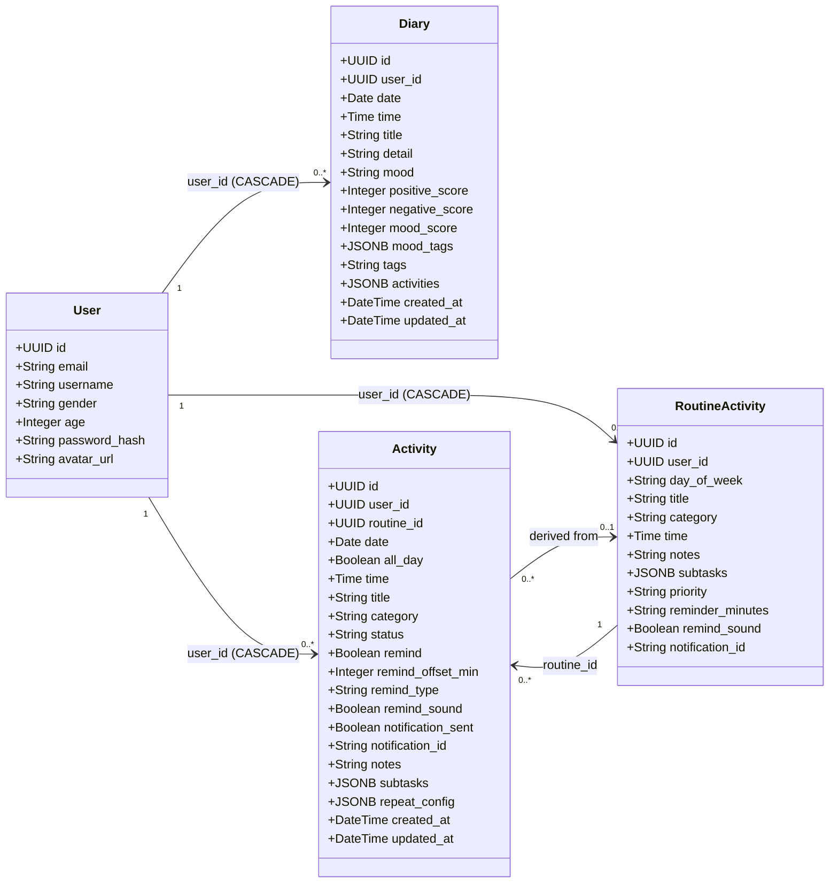
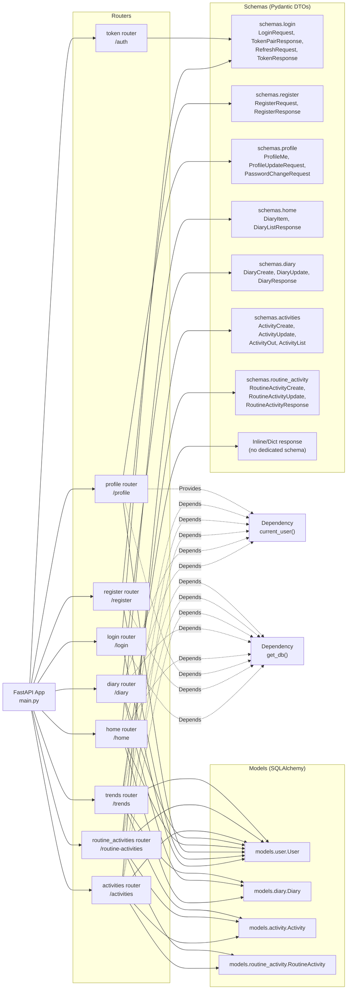

# Backend Class Diagram

## Notes

- This diagram is generated from SQLAlchemy models in `backend/models`.
- `Activity.routine_id` is optional, so an activity may or may not come from a routine template.
- `User` delete cascades to `Diary`, `Activity`, and `RoutineActivity` via foreign keys.

## Unified Architecture (Models + Schemas + Routers)

### Reading Guide

- `main.py` includes all routers into one FastAPI app.
- Routers validate request/response using Schemas (DTO layer).
- Routers query/write Models via SQLAlchemy session (`get_db`).
- Auth-protected routers rely on `current_user()` from `routers.profile`.
